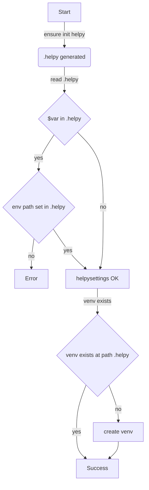

list
 - init helpy
 - read .helpy
 - if ${ in .helpy .env file is required
   - .env path is set in .helpy
     - read
   - error -> set env path in .helpy
 - check if venv exists

```mermaid
graph TB
    
    X[Error]
    Z[Success]
    
    
    A[Start] -->|ensure init helpy| B(.helpy generated)
    B -->|read .helpy| D{$var in .helpy}
    
    D -->|yes| E{env path set in .helpy}
    D -->|no| F[helpysettings OK]
    
    E -->|no| X
    E -->|yes| F
    
    F -->|venv exists| G{venv exists at path .helpy} 
    G -->|yes| Z
    G -->|no| H[create venv]
    H --> Z
    
```

